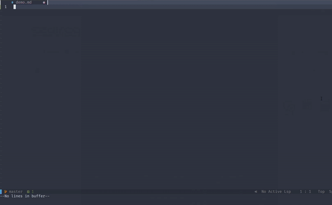

# mdclip.vim a Vim/Neovim plugin for mdclip

Allows you to rename image, and automatically folds the base64 encoded image in your markdown file

### mdclip Installation:

First install the appropriate binary into your $PATH from

    https://github.com/pcrandall/mdclip/releases/

### mdclip.vim Installation:

#### Packer

Add `use {"pcrandall/mdclip.vim"}` to your init.vim Then run `PackerCompile` followed by `PackerInstall` command in vim/nvim

#### Vim-Plug

Add `Plug "pcrandall/mdclip.vim"` to your init.vim Then run `PlugInstall` command in vim/nvim

### Usage

`:call Mdclip()` command in vim/nvim

### Mapping

No default mappings you can create your own using like this

**init.lua**

`vim.api.nvim_set_keymap('n', 'mdc', ':call Mdclip()<CR>', {noremap = true, silent = true})`

**init.vim**

`nnoremap <silent> mdc :call Mdclip()<CR>`

